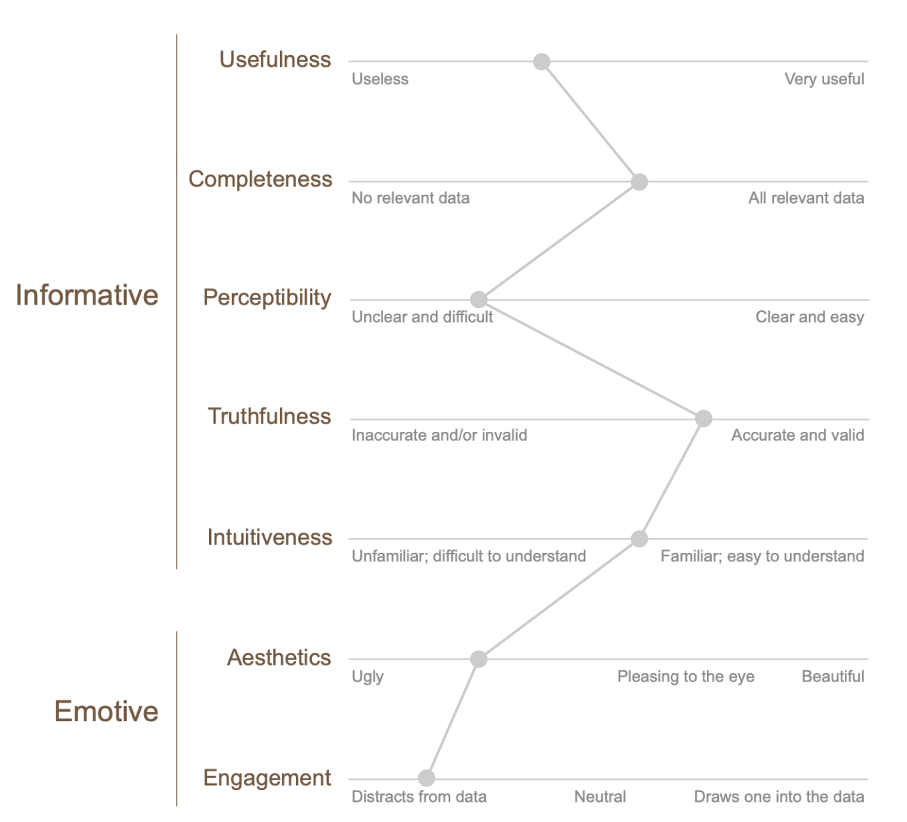
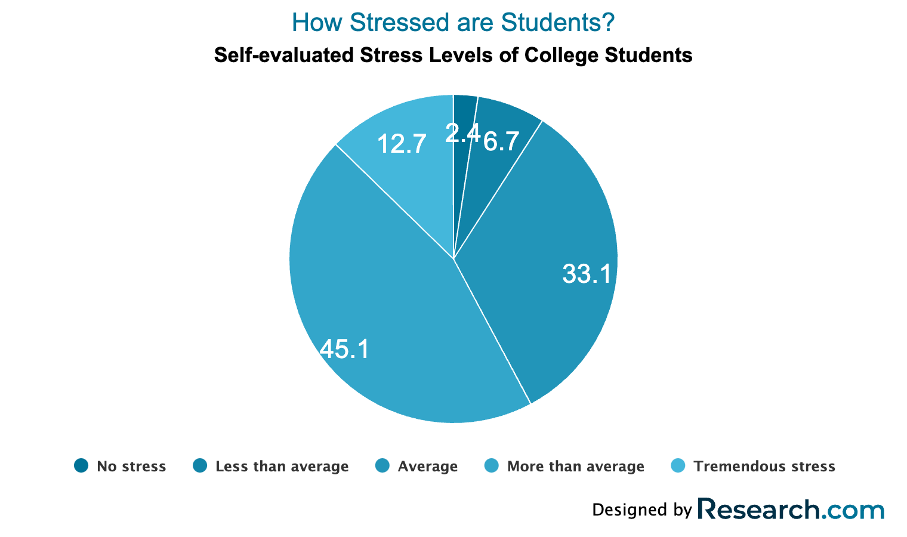
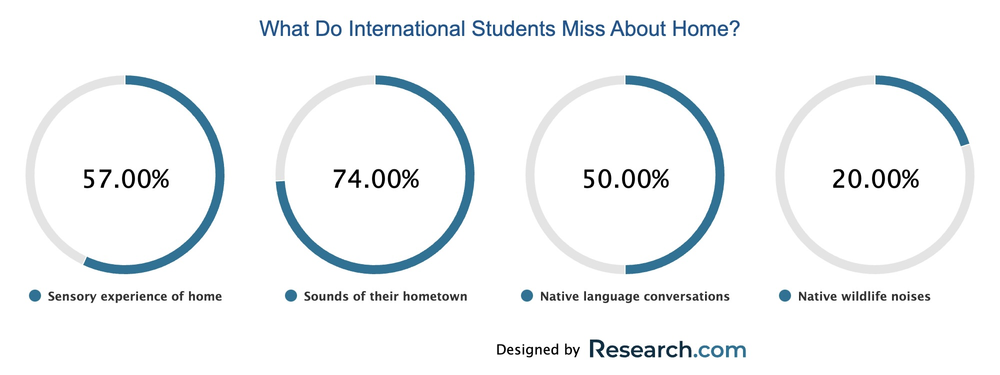
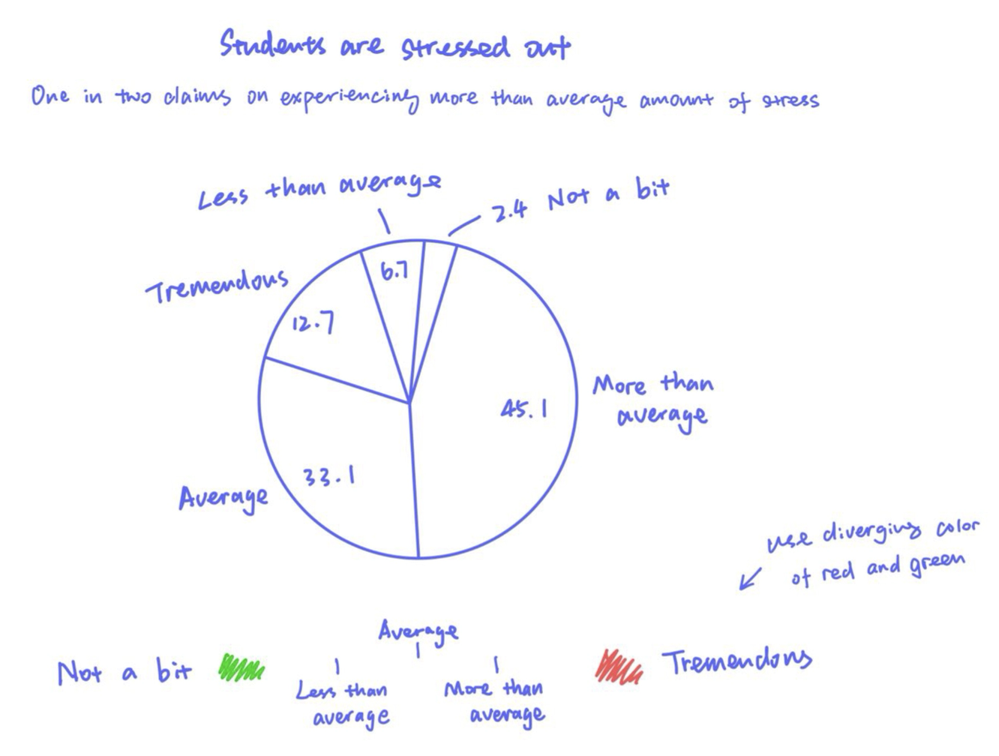
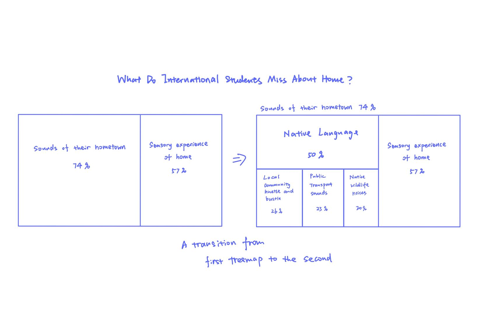

## Assignment 3 & 4: Critique by Design

> September.20th   
> [Source website for the original visualizations](https://research.com/education/student-stress-statistics)

### Why these charts need redesign?
As the semester proceeds, CMU students are experiencing an increasing amount of stress with a more significant workload and exams. Thus, I searched "College Student Stress Report" online and clicked on the first result that popped up. The report revealed different stress sources for students, including grades, bullying, homesickness, etc. It contains numerous visuals throughout the information. However, I found the visualizations poorly designed with a bad layout, wrong choice of color, and chart types. These flaws prevent them from adding value to the article, and I would love to see them delivered in a better form.  

Below is how I rate the visualizations on this site with the Data Visualization Effectiveness Profile:  

Overall, the charts on the site are functional as basic visualizations with accurate information and the necessary components. However, they are not appealing to readers and lack intriguing insights. Basically, not "interesting" enough to impress readers with the selected contents and persuade them with the given facts.

#### Critique on the Original Charts
There are multiple charts on this page. In the Google form, I critiqued on several of them with their positive and negative aspects. Since I don't have time to redesign every single one of them, I chose to focus on one pie chart and one donut chart.

#### Pie Chart:
  

Pros:
- clear chart titles that sum up the content
- show comparison between different categories

Cons:
- The sequential colors used for different categories are too similar
- Usually, deeper colors represent high density, but it is the opposite. The most significant stress is in the brightest blue. This can confuse people at first look
- The numbers are poorly positioned. For small slices, the number doesn’t fit in the piece.
- The current title is a good summary but doesn't tell a good story. It can be changed to something more informative.

#### Donut Chart:

Pros:
- Four donut charts show the proportion of each group side by side. Since they don't add up to 100%, donut charts are good choices for showing percentages.

Cons:
- The two zeros at the end of each percentage value are unnecessary.
- There is no emphasis on the chart with close percentages, single color, and small labels below each donut.
- As all the charts have the same color, there is no need to have a color legend below each one.
- According to the context (“These sounds include people talking in their native language (50%), local community hustle and bustle (26%), public transport sounds (25%), and native wildlife (20%).”), the “Native language conversations” and “native wildlife noises” are part of the “sounds of their hometown.” However, the chart compares them at the same level as separate categories, which is misleading.

### Sketch some ideas!
After evaluating the good and bad's of the two charts, I brainstormed ideas for improving each chart and sketched them in different layouts, chart types, and colors.

#### Pie Chart Remake:

Firstly, I rewrote the title and subtitle to be more informative. Compared to "How Stressed are Students?", I think "Students are stressed out" is a more powerful title that directly states the core meaning of the chart directly. Then for the subtitle, I wrote, "One in every two students claims to experience more than average amount of stress," which further illustrates the severe problem.

Then, I reordered the pie chart slices from large to small. I moved the number outside for the smallest slice that couldn't fit the number and connected it to the slice with a line. Instead of having a legend at the bottom, I repositioned the labels next to their corresponding slice to reduce readers' eye movement.

The original sequential colors used are too close to each other, which makes it hard to align the different pieces. So I decided to change it into diverging color between red and green. (Red for the "Tremendous" stress, and green for "Not a bit" of stress, as people tend to perceive green as good and red as a warning.)

#### Donut Chart Remake:

I think the donut chart is a good answer for this piece of data but not the best. Since this chart is more about displaying the different things that international students miss about home and what they miss more compared to others, I chose to amplify the difference between percentages of each element by using Treemap. 

Also, since "Native Language", "Local Community Hustle and Bustle," "Public Transport Sounds," and "Native Wildlife noises" are subcategories of "Sounds of their hometown," I came up with the idea of having a treemap inside treemap. So I split the "Sounds of their hometown" rectangle into small rectangles representing each subcategory. Then, if possible, there can be a transition animation between the two treemaps unfolding the "Sounds of their hometown" into more detailed sounds. And if that is too hard to realize, we can have both charts displayed side by side. 

I repositioned the labels with larger font inside the corresponding rectangles alongside the percentages. 

### Get some Feedback! 
#### Student, early 20's
<ins>Pie chart:</ins>  

Can you tell me what you think this is?  
>This pie chart represents groups of students experiencing different levels of stress.

Can you describe to me what this is telling you?   
>Most students are experiencing more than the average amount of stress.

Is there anything you find surprising or confusing?  
>I'm surprised that there are actually 2.4% of students that are not stressed at all :)

Who do you think is the intended audience for this?  
>I think the intended audience would be some researchers, educators, or anyone who works in the educational industry.

Is there anything you would change or do differently?
>The red and green color combo can be unfriendly for people with color blindness. Maybe try other colors.

<ins>Donut chart:</ins> 

Can you tell me what you think this is?
>These are the different things that international students miss about home. 

Can you describe to me what this is telling you?
>International students miss most of the sounds of their hometown.

Is there anything you find surprising or confusing?
>At first glance, I thought everything in the box adds up to 100%, which is not the case.

Who do you think is the intended audience for this?
>I think the intended audience would be some researchers, educators, or officers in the International Students departments.

Is there anything you would change or do differently?
>I would get rid of the percentage numbers or only show them when you hover onto one piece so that people won't mix them up with the usage of a pie chart where everything adds up to 100%. As what matters here is the comparison of quantity, the percentages won't be necessary.  

#### Adult, mid 20's
<ins>Pie chart:</ins>

Can you tell me what you think this is?
>Survey result of how much stress students have. 

Can you describe to me what this is telling you?
>More than half of the students are baring with huge stresses. 

Is there anything you find surprising or confusing?
>Not really. I understand how much stress students have especially in college where you need to do job search while having classes. 

Who do you think is the intended audience for this?
>People do research on students' mental health condition. 

Is there anything you would change or do differently?
>I would reduce the categories to only two: students with more than average amount of stress and students with average or below the amount of stress. Since the central message of the chart is that most students are stressed out, those medium categories don't matter here. 

<ins>Donut chart:</ins>

Can you tell me what you think this is?
>A display of things that international students miss. 

Can you describe to me what this is telling you?
>Students miss their hometown sounds the most, and within which, they miss the sound of their native language.

Is there anything you find surprising or confusing?
>It's interesting how people miss the sound of public transportation in their hometowns.

Who do you think is the intended audience for this?
>Maybe people who research international students' life in the US and their psychological condition.

Is there anything you would change or do differently?
>I like the idea of replacing the donut chart with a treemap. It will be more interesting to fill each area with corresponding colors or patterns.

### Final Design! 
#### Pie Chart Remake Version 1:

<noscript></noscript><object class='tableauViz'  style='display:none;'><param name='host_url' value='https%3A%2F%2Fpublic.tableau.com%2F' /> <param name='embed_code_version' value='3' /> <param name='site_root' value='' /><param name='name' value='StudentsStressReport&#47;Studentsarestressedout' /><param name='tabs' value='no' /><param name='toolbar' value='yes' /><param name='static_image' value='https:&#47;&#47;public.tableau.com&#47;static&#47;images&#47;St&#47;StudentsStressReport&#47;Studentsarestressedout&#47;1.png' /> <param name='animate_transition' value='yes' /><param name='display_static_image' value='yes' /><param name='display_spinner' value='yes' /><param name='display_overlay' value='yes' /><param name='display_count' value='yes' /><param name='language' value='zh-CN' /><param name='filter' value='publish=yes' /></object>
                

#### Pie Chart Remake Version 2:

<noscript></noscript><object class='tableauViz'  style='display:none;'><param name='host_url' value='https%3A%2F%2Fpublic.tableau.com%2F' /> <param name='embed_code_version' value='3' /> <param name='site_root' value='' /><param name='name' value='StudentStressReportVer_2&#47;Sheet1' /><param name='tabs' value='no' /><param name='toolbar' value='yes' /><param name='static_image' value='https:&#47;&#47;public.tableau.com&#47;static&#47;images&#47;St&#47;StudentStressReportVer_2&#47;Sheet1&#47;1.png' /> <param name='animate_transition' value='yes' /><param name='display_static_image' value='yes' /><param name='display_spinner' value='yes' /><param name='display_overlay' value='yes' /><param name='display_count' value='yes' /><param name='language' value='zh-CN' /><param name='filter' value='publish=yes' /></object>
                

 