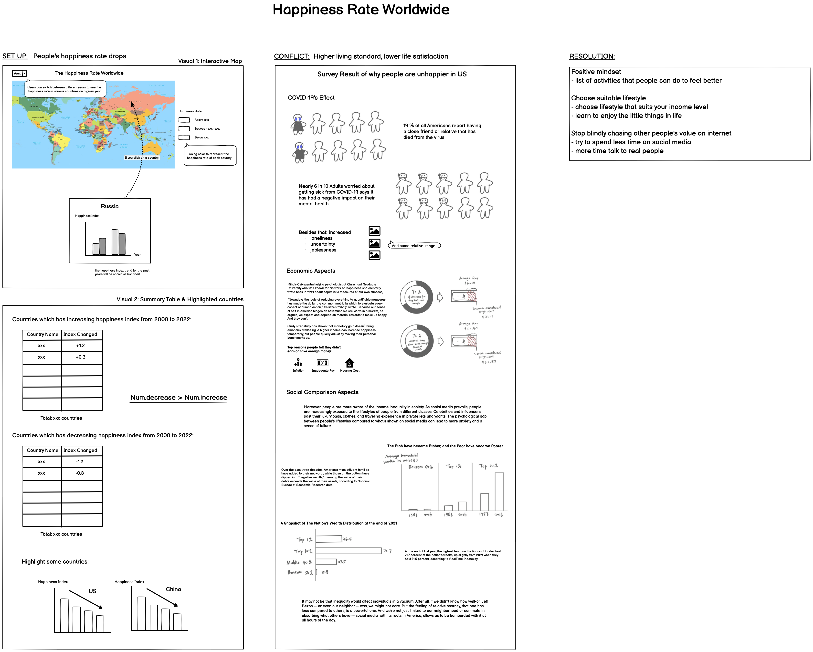
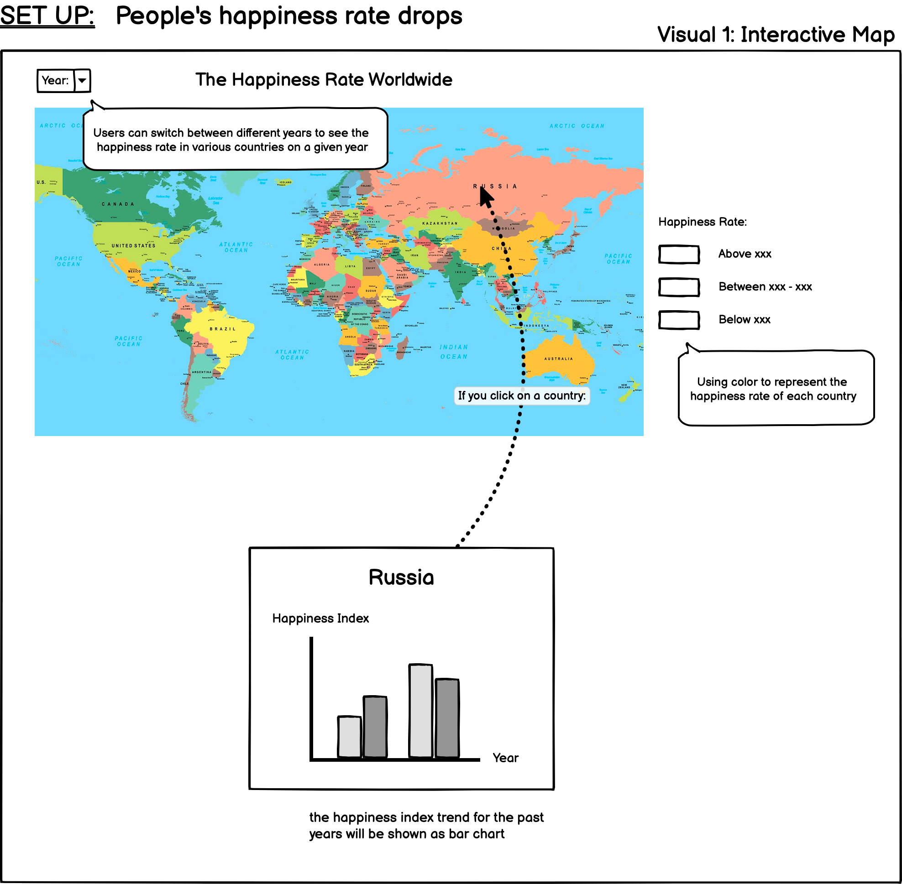
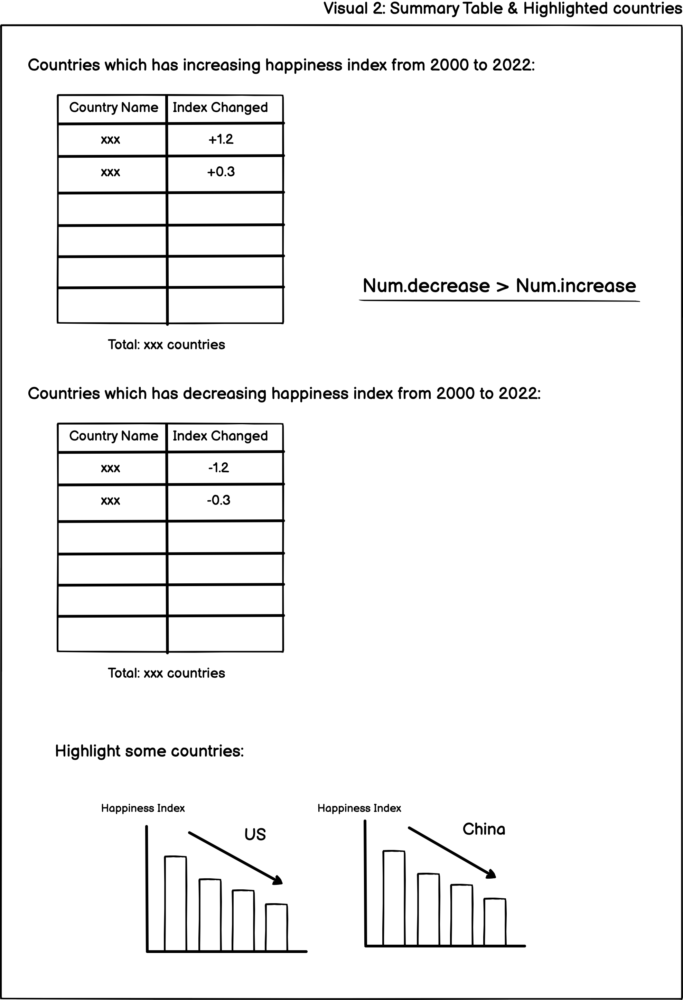
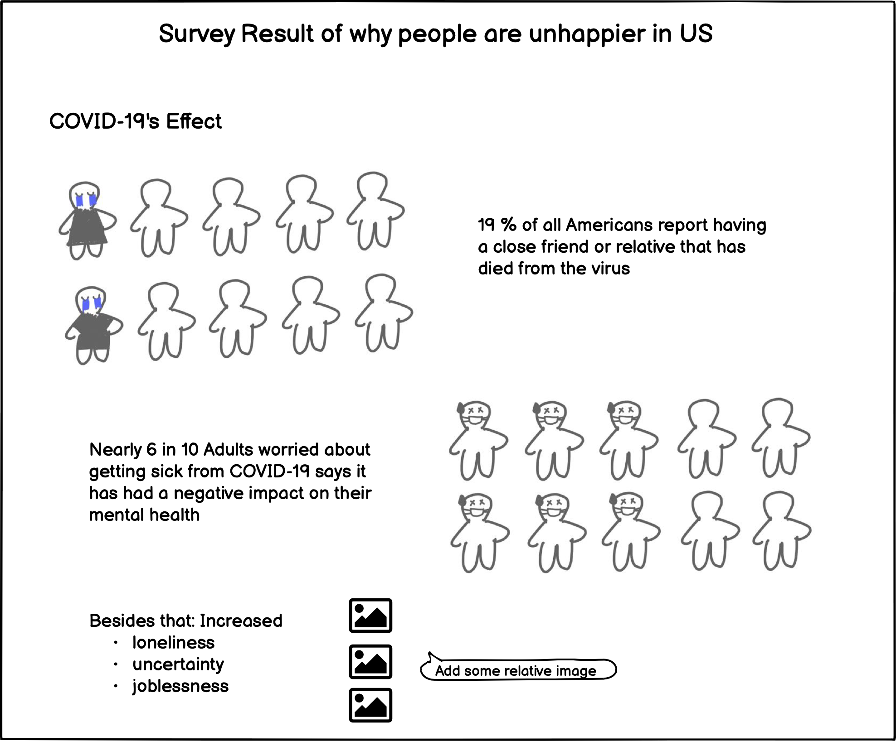
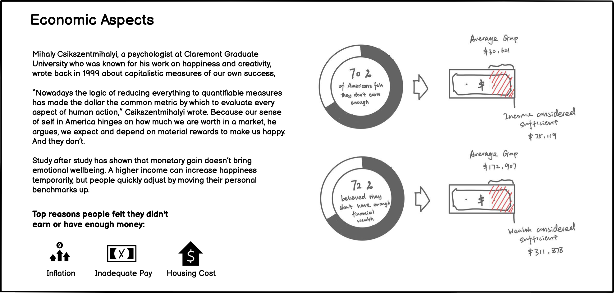
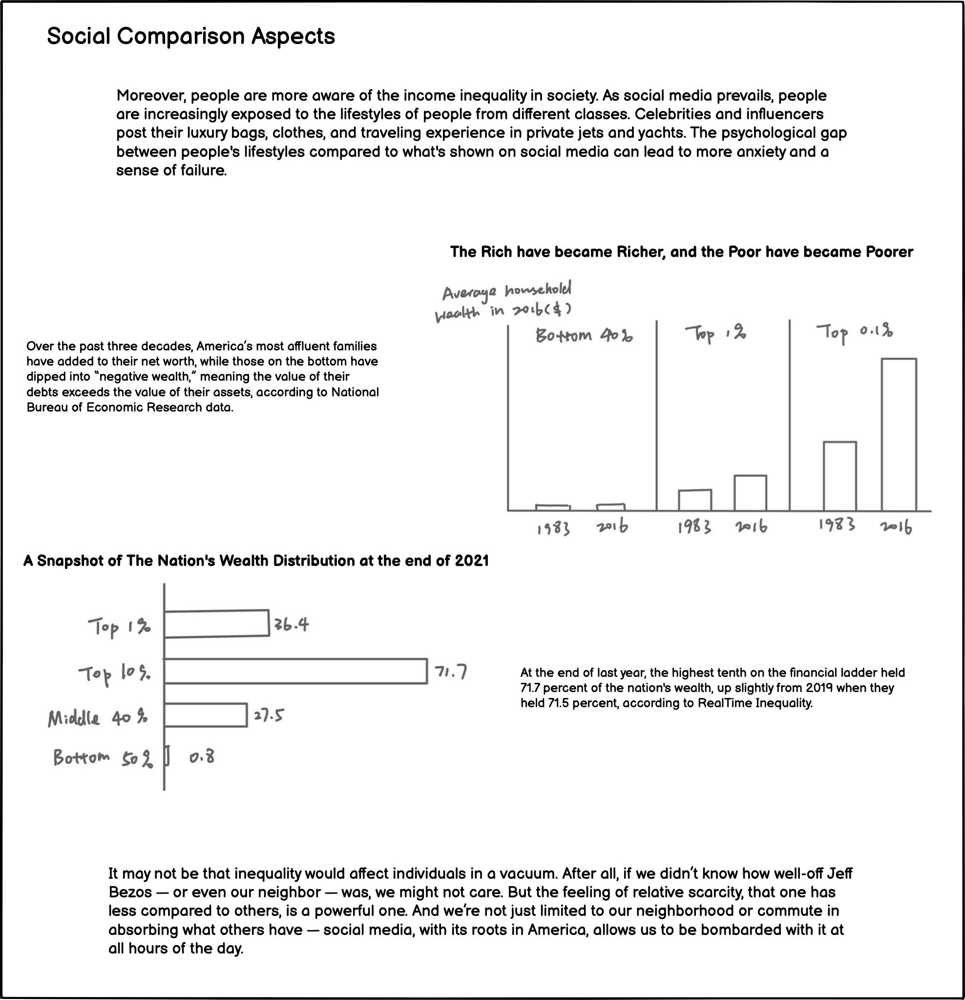

### Final Project - Part I

September 22nd 

#### Outline
In summary, I want to talk about people's happiness rate worldwide, how they changed over time, and what elements caused the changes. Recently, since graduation is close, many of my friends have been making a massive effort trying to find their first full-time job, and many have been complaining to me about how hard it is to find employment right now, both in the US and in China. Especially my peers at CMU, we are under the stress of completing the large workload at school and doing job searches simultaneously. When I chatted with my mom about the situation, she told me how life was more straightforward with less stress and more explicit goals in old times, although the living standard was much lower. Thus, I would like to dig into how contemporary people seem less satisfied with life even though we live on higher standards with better food, housing, transportation, and technologies.

**Setup:** The Happiness score in multiple countries, including the US, has been decreasing.

**Conflict:** Although people are improving material well-being, people are less happy, and here is why:
- COVID-19's Effect
- Economic Effect 
- Social Comparison Effect

**Resolution:** Implement a positive living mindset and choose a lifestyle that suits you instead of blindly chasing people on the internet.

#### Initial Sketches

This is an overview of the sketch I made using Balsamiq Wireframes. Since the charts and texts are small, I will go through the sketch one part at a time below.

  

For the first visual of the Set-up section, I want to make an interactive map that shows the Happiness Index in different countries in a given year. The map will be in diverging colors with countries with higher Happiness Index in bright color and countries with lower Happiness Index in dark color. On the top left side, the viewer can filter different years. When the viewer clicks on a country, a bar chart should appear on a pop-up showing the trend of the Happiness Index through the years. This interactive map provides a platform for viewers to explore how happy people are around the world and whether things change as time passes.

For the second visual of the Set-up section, I want to convey how people have been unhappier worldwide in recent years by comparing the number of countries with increasing or decreasing Happiness Index. Therefore, I plan to create two tables showing the countries in each category and how much the index changed for the country. In addition, I want to highlight the trend of dropping the Happiness Index in two countries I care about most: the US and China(my home country). For this project, I will dig into some reasons that cause the trend in the US. I may redesign the charts to be more creative than simple column charts.

Then, after 

#### Data
Following are the data sources that I used to create the visualizations: 
> "Happiness score (WHR)" from Gapminder   
> [Source URL](https://docs.google.com/spreadsheets/d/1Jo6_-6W36Qx2IPa_61JLyQ5zUJAXRIcLcU5zBlUa7pM/edit#gid=501532268)  

This is the national average response to the question of life evaluations asking the following "Please imagine a ladder, with steps numbered from 0 at the bottom to 10 at the top. The top of the ladder represents the best possible life for you, and the bottom of the ladder represents the worst possible life for you. On which step of the ladder would you say you personally feel you stand at this time?" This measure is also referred to as the Cantril life ladder. Gapminder has converted this indicator's scale from 0 to 100 to easily communicate it in terms of percentage. I will use this data to create an **interactive map, the bar charts of each country showing the happiness trend, and the tables summing up countries with increasing or decreasing Happiness Index from 2000 to 2021**.

> Survey from the Associated Press-NORC Center for Public Affairs Research at the University of Chicago  
> [Source URL](https://apnorc.org/projects/the-coronavirus-pandemic-one-year-later/)

This survey was conducted online and through telephone interviews using landlines and cell phones with 1,434 adults. One of the survey questions is whether you have a close friend or relative that has died from the COVID-19 virus. This data is used to visualize **how many people are mentally wounded by the death of someone close caused by the pandemic**.

> Analysis from the March KFF COVID-19 Vaccine Monitor  
> [Source URL](https://www.kff.org/coronavirus-covid-19/poll-finding/mental-health-impact-of-the-covid-19-pandemic/)

This analysis explores the group of people who took the hardest hits by the mental health impacts of the coronavirus pandemic. This data is used to visualize **how many adults are negatively affected on their mental health worrying about getting sick from COVID-19**.

> Survey by the site "I WILL TEACH YOU TO BE RICH"  
> [Source URL](https://www.iwillteachyoutoberich.com/blog/how-much-money-is-enough/#:~:text=Here%27s%20what%20we%20found%20out,they%27re%20not%20making%20enough)

The survey interviewed over 1,000 Americans to find the answer to the question, "Are you earning enough money?". I used the data to visualize **what percentage of Americans felt they don't earn enough or have enough financial wealth and what are their standards of "enough."**

> National Bureau of Economic Research  
> [Source URL](https://inequality.org/facts/wealth-inequality/)

This data is from a paper published by NBER, "Household Wealth Trends in the United States, 1962 to 2016: Has Middle-Class Wealth Recovered?". I used the data to visualize **how income inequality has widened in the US in the past years**, where the net worth of the upper class has significantly increased, and the lower class is getting worth with debts exceeding their assets.

> Study conducted by the Atlanta Journal-Constitution  
> [Source URL](https://www.governing.com/finance/the-pandemic-enriched-americans-but-wealth-gap-still-grew)

The study explored the national wealth distribution in the US. I used the data to visualize **the share of the nation's wealth**, by income group, at the end of 2021.

#### Method and medium
I will use Shorthand to create this visualization. For the charts embedded in it, I will use Flourish or Tableau. For the interactive map at the beginning, where the viewer should be able to click and explore the Happiness Index trend of individual countries, I may need to use tools other than Tableau and Flourish, but I'm not sure what I will use yet.

#### Reference
1. AP-NORC Center for Public Affairs Research. “The Coronavirus Pandemic: One Year Later.” AP-NORC, 11 Mar. 2021, apnorc.org/projects/the-coronavirus-pandemic-one-year-later/. Accessed 30 Sept. 2022.
2. Basse, Andrea. “70% of Americans Say They Don’t Earn Enough Money.” I Will Teach You to Be Rich, 3 Mar. 2022, www.iwillteachyoutoberich.com/blog/how-much-money-is-enough/#:~:text=Here%27s%20what%20we%20found%20out. Accessed 30 Sept. 2022.
3. Gapminder. “Data.” Gapminder.org, 2019, www.gapminder.org/data/.
4. Kanell, Michael E. “The Pandemic Enriched Americans but Wealth Gap Still Grew.” Governing, 21 Apr. 2022, www.governing.com/finance/the-pandemic-enriched-americans-but-wealth-gap-still-grew.
5. Kearney, Audrey, et al. “Mental Health Impact of the COVID-19 Pandemic: An Update.” KFF, 14 Apr. 2021, www.kff.org/coronavirus-covid-19/poll-finding/mental-health-impact-of-the-covid-19-pandemic/.
6. Putka, Sophie. “Why Are Americans Getting Unhappier?” Discover Magazine, 19 June 2021, www.discovermagazine.com/mind/why-are-americans-getting-unhappier.
7. Wolff, Edward N. “Household Wealth Trends in the United States, 1962 to 2016: Has Middle Class Wealth Recovered?” National Bureau of Economic Research Working Paper Series, 30 Nov. 2017, www.nber.org/papers/w24085.

