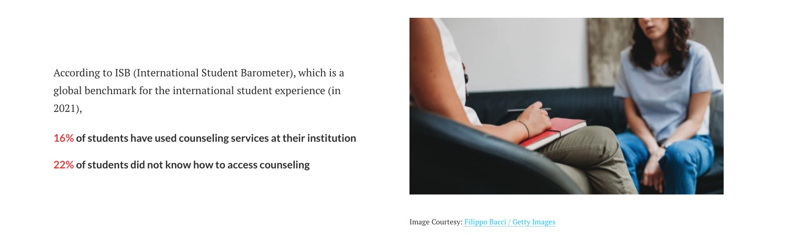
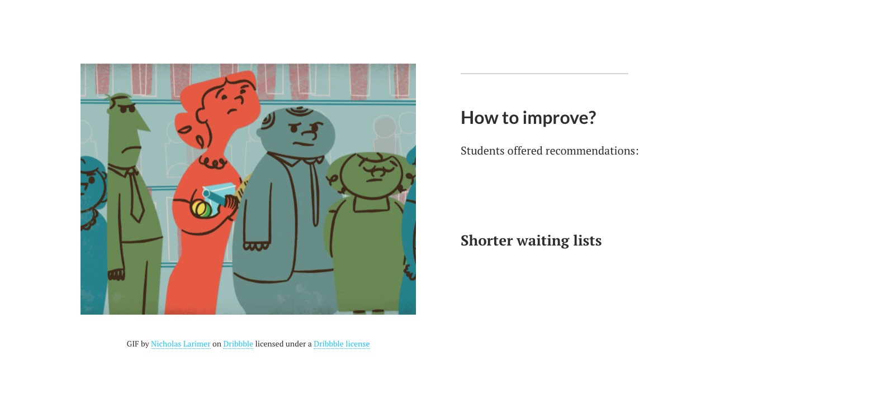
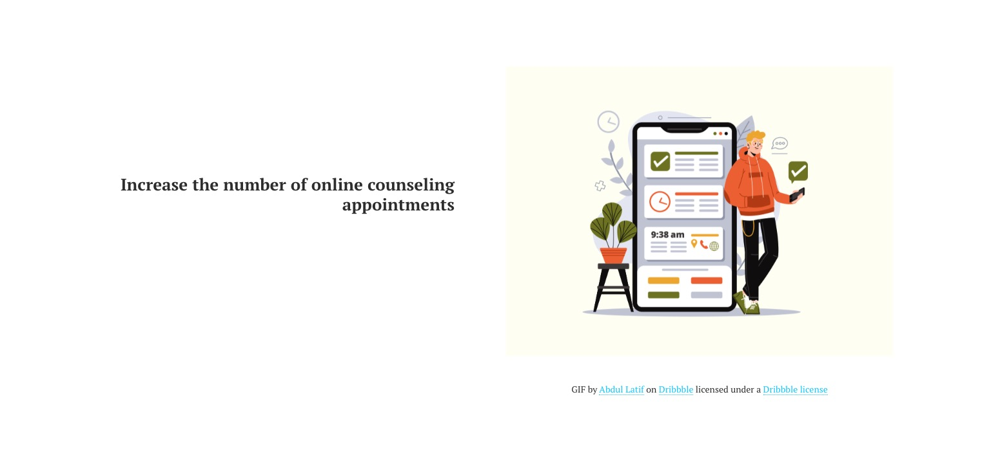
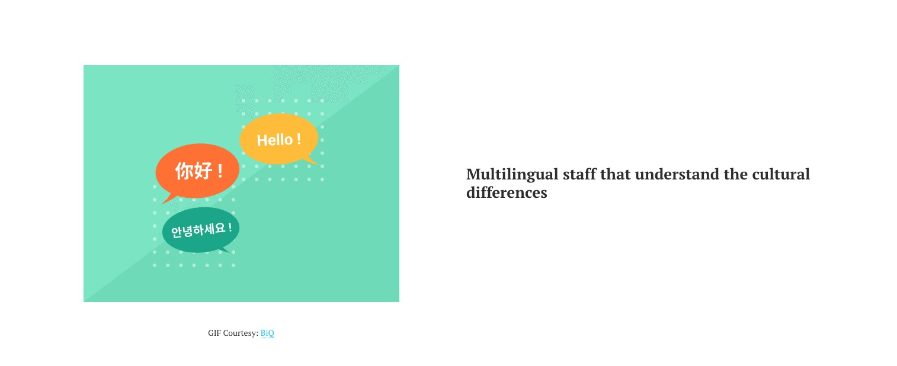
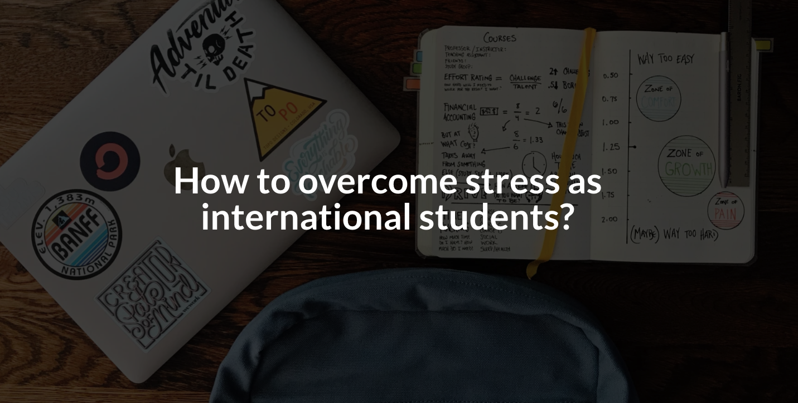

### Final Project - Part III

October 12th 

> The final data story: [Shorthand Link](https://carnegiemellon.shorthandstories.com/international-students-stress-level/index.html)

### Previous Project Process
>Outline, Initial Sketches, Data, and Medium: [Part I](final-project-part1.md)  
>User Research, Improvements, and First half on Shorthand: [Part II](final_project_part2.md)

### Changes After Part II
Since I haven't fully finished my Shorthand when I completed part II, I added the thought process for making the remaining parts here.

This is where I left last time. Below the topic of how international students are highly expected from their family and themselves, I would like to illustrate how things are even worse after the COVID. Thus, I searched for some data on how college students are affected by COVID.
> Data Source: [Survey from NCBI](https://www.ncbi.nlm.nih.gov/pmc/articles/PMC7451187/)  

It shows how different percentages of students are affected in terms of work and academic performance. I made a bubble chart to illustrate the different percentages. 

A larger bubble means a larger percentage. The bubbles on the left within the "Career Outcome" bubble represent work-related aspects. Similarly, the right side is aspects related to School. I tried to make the two large bubbles "Career Outcome" and "Academic Outcome" the same size, but I failed in Flourish. Thus, it may confuse users on whether the size difference means anything. Here, it doesn't mean anything besides categorizing the smaller bubbles.

The last factor is Loneliness. International students tend to get lonely being far away from family and old friends. According to survey results from SHURA, 72.13% of international students have experienced symptoms of loneliness. I used a bar chart to visualize the large percentage. Below, I listed some common factors that can cause loneliness with icons.

#### Call on action and Audiences 
This is the end of the Stressors Analysis section. Next, for the call to action, I created two sections for different audience.

The first audience is **universities' counseling service providers**.

Currently, only less than one fifth of students have used the counseling services at their institution. The students provided some recommendations on how to improve the counseling services.

I added GIF next to each tip to help quick understanding and make the page more interesting to look at. 

The second group of audience is **international students**.

I made scroll-points to display several tips for international students to overcome stress. 
- Go out of your comfort zone and emerge yourself in the language
- Give yourself time to adapt
- Don't hold yourself to unrealistic standards
- Meet new people, find new interests/ Stay in touch with your friends and family

At the end of the tips, I added the link to the Counseling and Psychological Services at CMU. I didn't know there were such services at CMU at all. So if students ever need someone to talk to about their academic or personal life to release stress or talk about any struggles, they can make appointments on the website of this link.

#### References and Image copyrights 
That's the end of my project. After this page, I added a reference page with all my used resources. For the images that I used that are not from Unsplash, I added footnotes below each image with the author, the source, and the license information. For each chart I made with Flourish, I added the data source as footers with the link to the source.

#### What I learned along the way
- Don't get too restricted on the chart types

Since most of my data are in the form of survey results, the numbers I get are usually percentages. The usual chart type for percentages are pie charts and donut charts. However, as I didn't want to bore my user with the same chart type all the way, I spent a lot of effort trying to diversify the chart types that I used. For example, bar charts, column charts, or treemaps can also represent percentages. In addition, I found it intriguing to explore the different possibilities of visualizing the same dataset. Thus, don't get too restricted by what type of chart is commonly used to visualize a kind of data. Instead, try out new things and get creative. Sometimes the result can be surprisingly good.

- User feedback is super useful for improving the visualization  

After staring at the charts for a long time, it is hard to decide what is good and what is terrible for my project. I just got numb on them. Thus, I made different versions of charts for the same dataset and showed them to my friends for some feedback. They quickly identified issues and potential changes I could make to my charts and helped me decide which version was the best. Getting advice from a reader's perspective can help me perfect my project. It is always good to have a fresh set of eyes. 

