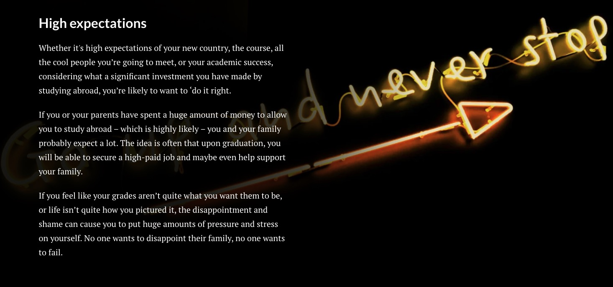
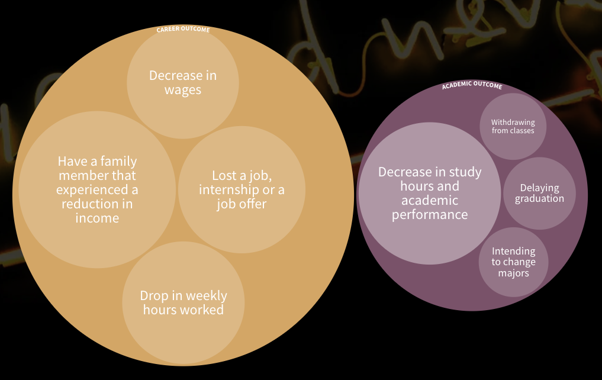
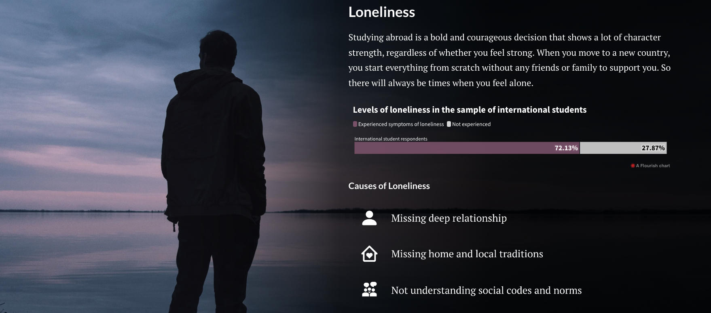
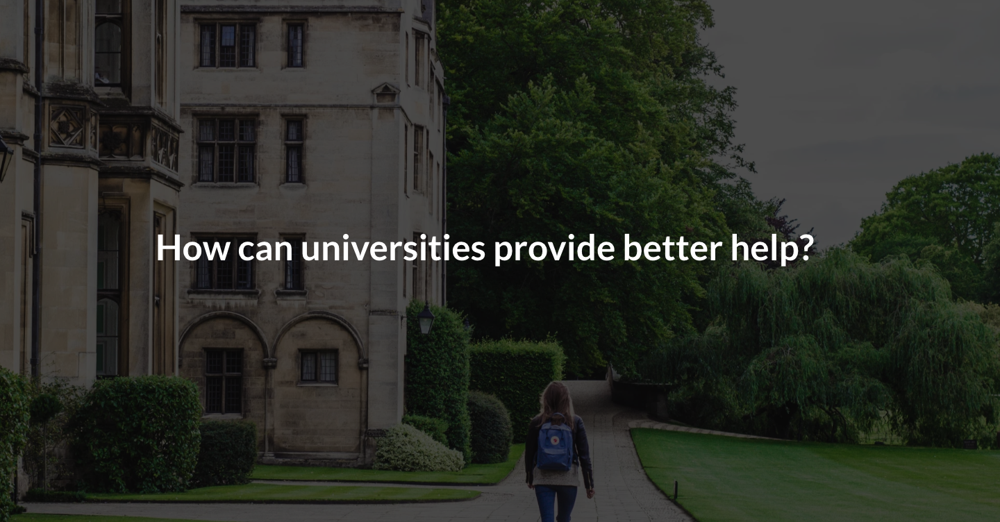

### Final Project - Part III

October 12th 

> The final data story: [Shorthand Link](https://carnegiemellon.shorthandstories.com/international-students-stress-level/index.html)

### Changes After Part II
Since I haven't fully finished my Shorthand when I completed part II, I added the thought process for making the remaining parts here.

This is where I left last time. Below the topic of how international students are highly expected from their family and themselves, I would like to illustrate how things are even worse after the COVID. Thus, I searched for some data on how college students are affected by COVID.
> Data Source: [Survey from NCBI](https://www.ncbi.nlm.nih.gov/pmc/articles/PMC7451187/)  

It shows how different percentages of students are affected in terms of work and academic performance. I made a bubble chart to illustrate the different percentages. 

A larger bubble means a larger percentage. The bubbles on the left within the "Career Outcome" bubble represent work-related aspects. Similarly, the right side is aspects related to School. I tried to make the two large bubbles "Career Outcome" and "Academic Outcome" the same size, but I failed in Flourish. Thus, it may confuse users on whether the size difference means anything. Here, it doesn't mean anything besides categorizing the smaller bubbles.

The last factor is Loneliness. International students tend to get lonely being far away from family and old friends. According to survey results from SHURA, 72.13% of international students have experienced symptoms of loneliness. I used a bar chart to visualize the large percentage. Below, I listed some common factors that can cause loneliness with icons.

This is the end of the Stressors Analysis section. Next, for the call to action, I created two sections for different audience.

The first section is 

**Add images' copyright marks**

