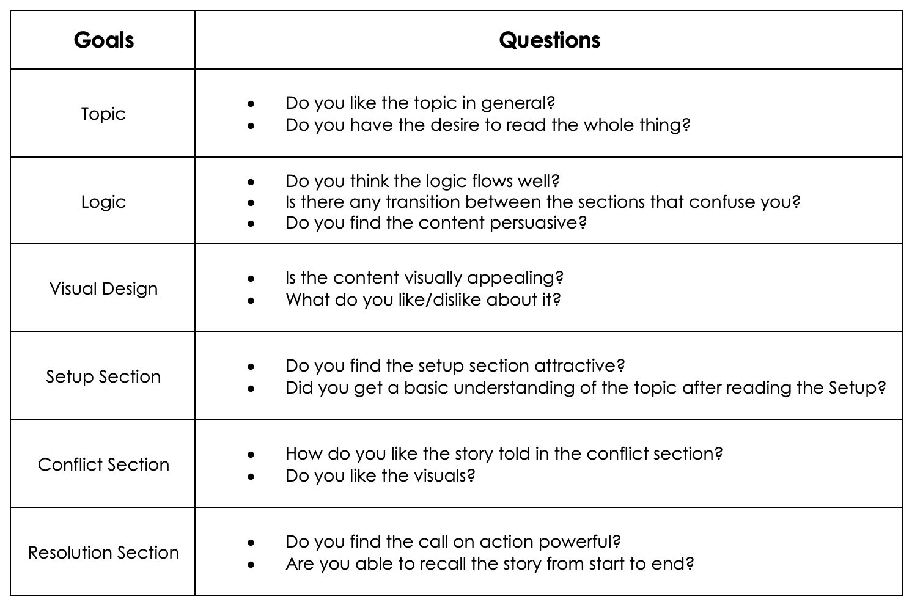

### Final Project - Part II

October 4th 

For this part, I will improve the wireframe I built in Part I based on the user feedback I gathered. I will also start making some drafts in Shorthand.

At the start, I will show the wireframe I made in Part I for reference:

### User Research

#### Goals/Questions
