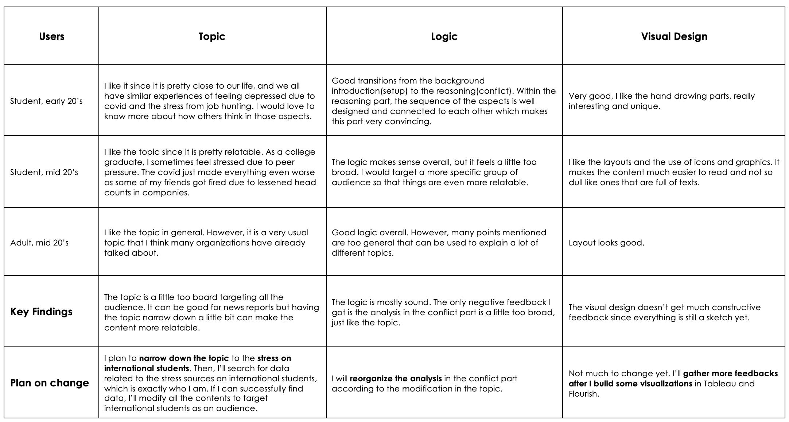
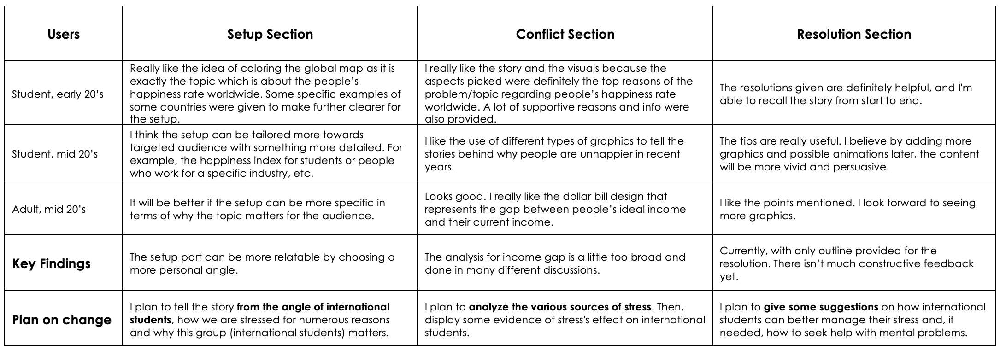

### Final Project - Part II

October 4th 

For this part, I will improve the wireframe I built in Part I based on the user feedback I gathered. I will also start making some drafts in Shorthand.

At the start, I will show the wireframe I made in Part I for reference:

### User Research

#### Goals/Questions
The following are some different aspects that I want to get feedback on. Then, on the right are some questions I would ask the users.

#### Feedbacks, Key findings and Plan on change
I gathered feedback from 3 people using the questions that I prepared above. I recorded the feedback from each of them below and summed up some key findings for each section. Finally, based on the key findings, I made some plans on how to change each section.

What I get told most is my topic of "Happiness Rate Worldwide" is too broad to be persuasive. It is more like a research paper that describes a fact instead of telling a convincing story. Since the topic can be applied to almost any audience group, it is hard to make it particularly relatable. Thus, I narrowed the subject to "The Stress Level of International Students." I am an international student who felt tremendous stress trying to succeed in both coursework and job searching as graduation day approaches. Thus, I want to raise awareness of how international students are generally under higher stress being far away from home. I believe this topic will be more meaningful coming from a personal angle and relatable for all the international students in the class. I understand it will be a lot of work rewriting outlines and finding new data sources, but I believe it is worth it if I can deliver better work.

#### New Outline
I rewrote the outline to match the new topic.

**Setup:** International students are generally under higher stress due to unique mental stressors:
- Language Barriers
- Culture Shock
- High expectations
- Loneliness

**Conflict:** Although international students are experiencing huge stress, they are not actively seeking mental health supports, and here is why:
- Unsure whether the cost of counsellings are included in their Overseas Student Health Cover
- Long wait times to get counselling appointments
- Staff who did not speak a language other than English and who lacked awareness of cultural differences
- Worries that if they revealed a mental health challenge, their enrolment status would be jeopardised
- Lack of regular communication about available services

**Resolution:** 
- Shorter waiting lists
- Increasing the number of online counselling appointments
- Clear and updated information on university FAQ pages
- Staff with diverse culture backgrounds 

#### Shorthand
[Shorthand Link](https://preview.shorthand.com/9uBSyThFDIlkvd8c)