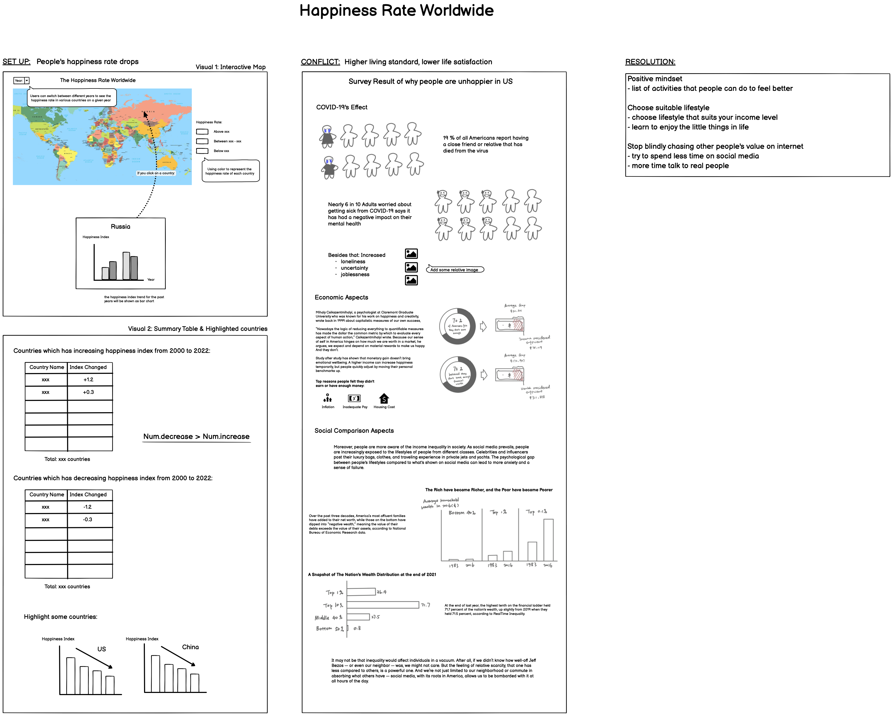
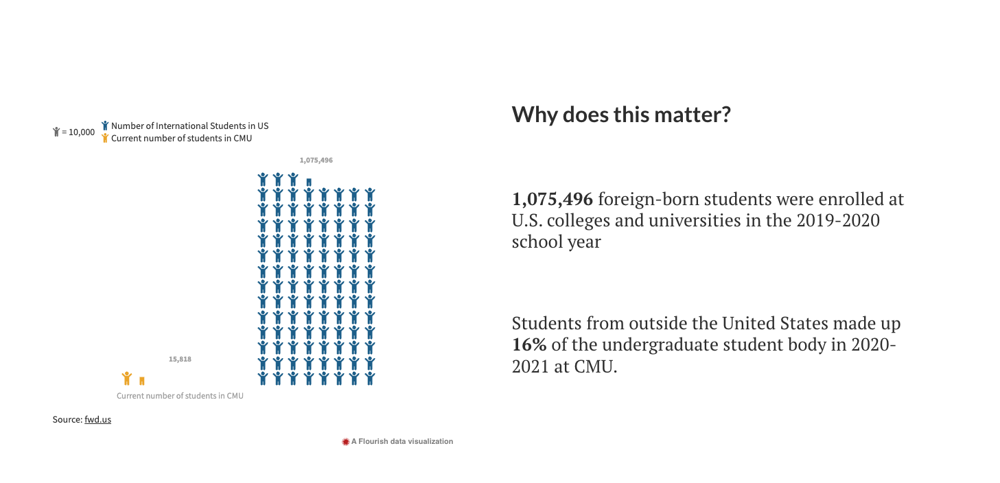
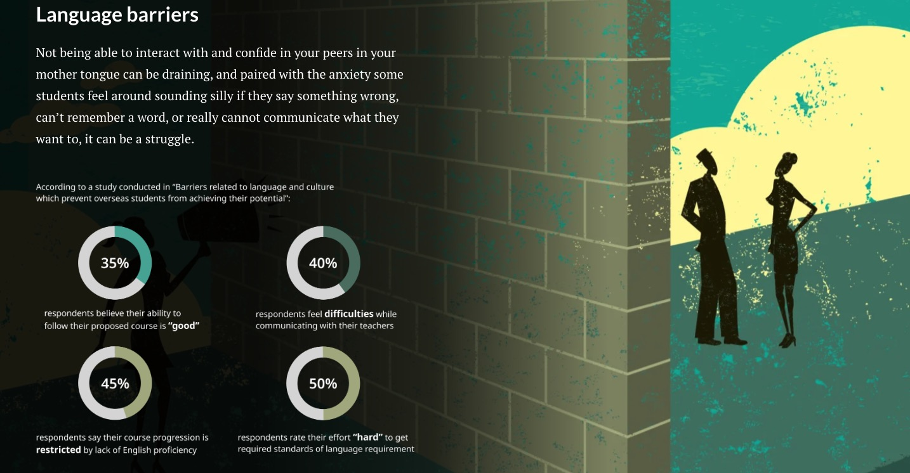
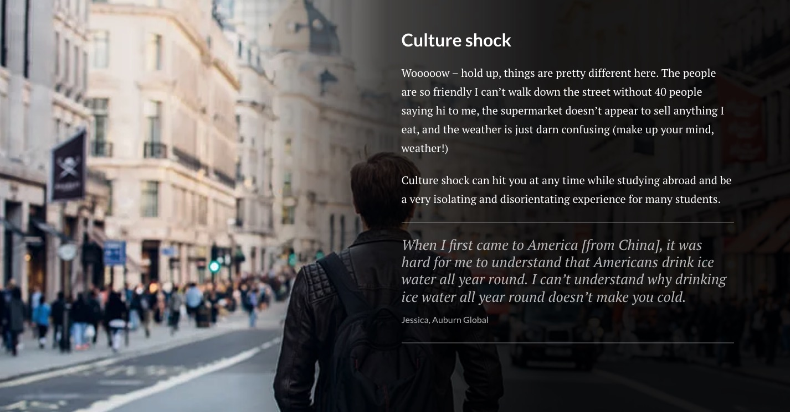
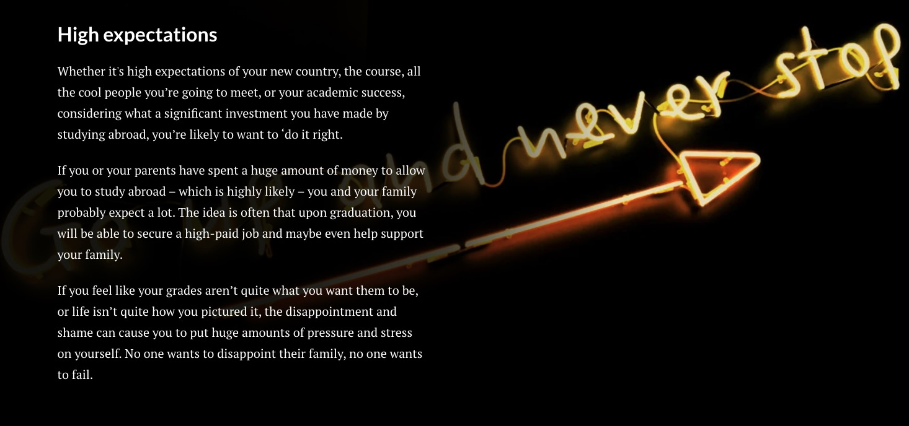

### Final Project - Part II

October 4th 

For this part, I will improve the wireframe I built in Part I based on the user feedback I gathered. I will also start making some drafts in Shorthand.

At the start, I will show the wireframe I made in Part I for reference:

### User Research

#### Goals/Questions
The following are some different aspects that I want to get feedback on. Then, on the right are some questions I would ask the users.

#### Feedbacks, Key findings and Plan on change
I gathered feedback from 3 people using the questions that I prepared above. I recorded the feedback from each of them below and summed up some key findings for each section. Finally, based on the key findings, I made some plans on how to change each section.

What I get told most is my topic of "Happiness Rate Worldwide" is too broad to be persuasive. It is more like a research paper that describes a fact instead of telling a convincing story. Since the topic can be applied to almost any audience group, it is hard to make it particularly relatable. Thus, I narrowed the subject to "The Stress Level of International Students." I am an international student who felt tremendous stress trying to succeed in both coursework and job searching as graduation day approaches. Thus, I want to raise awareness of how international students are generally under higher stress being far away from home. I believe this topic will be more meaningful coming from a personal angle and relatable for all the international students in the class. I understand it will be a lot of work rewriting outlines and finding new data sources, but I believe it is worth it if I can deliver better work.

#### New Outline
I rewrote the outline to match the new topic.

**Setup:** International students are generally under higher stress.

**Conflict:** The stress are caused by unique mental stressors:
- Language Barriers
- Culture Shock
- High expectations
- Loneliness

**Resolution:** 
What can be done by international students: (list of tips for handling each stressor)
What can be done by universities:
- Shorter waiting lists for mental counselling
- Increasing the number of online counselling appointments
- Clear and updated counselling information on university FAQ pages
- Counselor with diverse culture backgrounds 

#### Shorthand
Since I switched my topic after gathering feedbacks, I wasn't able to finish all the Shorthand. Below is the link to the Shorthand that I completed.  
[Shorthand Link](https://preview.shorthand.com/9uBSyThFDIlkvd8c)

Next, I'll go through each page of the Shorthand that I made so far. 

**Cover Page**
I think I can think of a better title, but no idea so far. 

**Background**
This paragraph briefly talked about the background of my topic. 

Some statistics illustrating the problem are visualized by highlighting the number of stressed students among every ten international students according to the proportion.

**Why does it matter**
I used stacked icons here to represent the quantity since it gives a direct visual comparison. 1,075,496 is a large number, but without comparison, the audience will not clearly understand how large it is. Since the primary audience is all CMU students, I figured it would make sense to compare the number to the current number of CMU students. Now, the audience will better grasp how large the group (international students) is.

**4 Unique Mental Stressors**
Audience is guided to the Analysis section after the Setup. In this section, the four unique mental stressors faced by international students are discussed. 

Firstly, the language barrier is a critical element that causes stress for international students. Below the paragraph, I presented some survey results on how language barriers have affected students' ability to complete studies. I used donut charts here since they are suitable for percentages and not as overwhelming as a pie chart for only presenting one ratio in each graph. I highlighted the keywords under each donut chart, explaining the percentage.

Secondly, culture shock. On the second page, I created a bar chart displaying the biggest culture shocks Japanese people experienced in the US. The data represents the times each culture shock is mentioned in the top 15 websites in Google Search. Then, I ordered them by value. Interestingly, Japanese people are most surprised by the huge amount of food in the US.

The third factor is high expectations. But I haven't finished the rest of the content so far. I still have two more elements to illustrate and the resolution at the end. I will complete them this weekend and update the contents here.

#### Reference
1. Ali, Syed, and Raza Bukhari. Barriers Related to Language and Culture Which Prevent Overseas Students from Achieving Their Potential. 31 Jan. 2015.
2. Bilton, Isabelle. “5 Points of Stress for International Students – and How to Overcome Them.” Study International, 14 May 2018, www.studyinternational.com/news/5-points-stress-international-students-overcome/.
3. Carnegie Mellon University. “International Applicants - Undergraduate Admission - Carnegie Mellon University.” Www.cmu.edu, 7 July 2021, www.cmu.edu/admission/admission/international-applicants#:~:text=Carnegie%20Mellon%20often%20ranks%20in. Accessed 8 Oct. 2022.
4. Funalysis. “What Shocks Japanese the Most in the US, 10 Examples Ranked” Funalysis, 21 Jan. 2019, www.funalysis.net/culture-what-shocks-japanese-the-most-in-the-us-10-examples-ranked. Accessed 8 Oct. 2022.
5. FWD.us. “International Students & Graduates in the U.S.” FWD.us, 15 Dec. 2021, www.fwd.us/news/international-students/.
6. ICEF Monitor. “Do International Students Face Additional Barriers in Accessing Mental Health Supports?” ICEF Monitor - Market Intelligence for International Student Recruitment, 10 Aug. 2022, monitor.icef.com/2022/08/do-international-students-face-additional-barriers-in-accessing-mental-health-supports/. 
7. Killorin, Matt. “How to Deal with Culture Shock: A Guide for International Students.” Shorelight.com, 4 Mar. 2022, shorelight.com/student-stories/how-to-deal-with-culture-shock-a-guide-for-international-students/.

